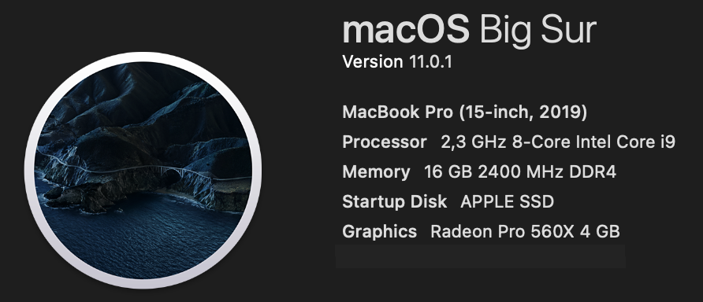
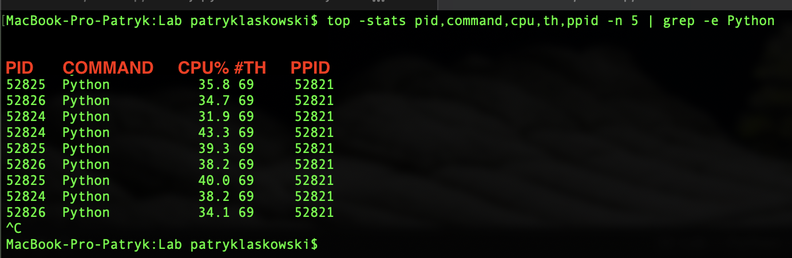
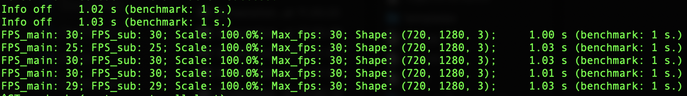
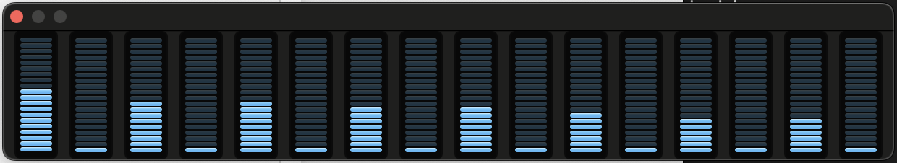
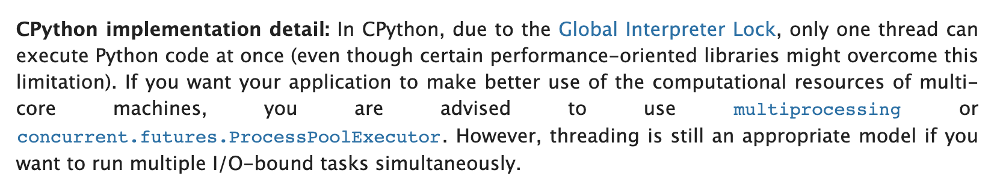
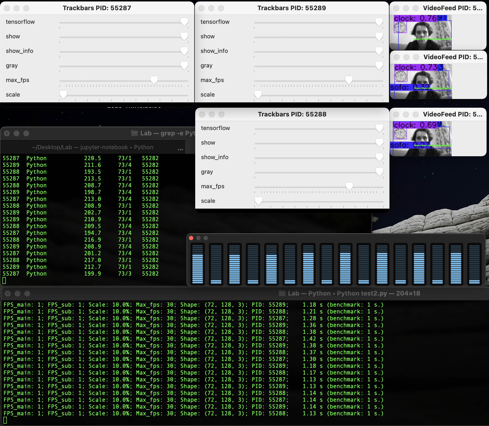

# Patryk Laskowski
---

## Questions to answer

#### I. Display OFF vs ON (No Tensorflow)
- Is displaying the results in real time coputionally expensive?
- If so, is it might be optimized?

#### II. Tensorflow ON/OFF (actually computing the results)
- How CPU consuming is to run TF model?
- What is the FPS rate when TF is making predictions? Is there any change in FPS rate?
- How about number of threads? Does it increase?
- Is it any helpful to not display the results at all when output is 10% of oryginal?

#### III. Multiprocessing solution
- Does multiprocessing (when each computation is assigned to single separate process) helps in runtime?
- When number of processes increase linearly does the CPU consumption increase linearly as well?

# Computer parameters:
---

### Overwiew:

<p></p>
<br>


### Displays:

<p align="left"></p>
<br>

# Tools

---


### Python process CPU consumption as well as number of threads command

```bash
top -stats pid,command,cpu,th,ppid -n 5 | grep -e Python
```

<p align="left"></p>


### Example app output

```bash
python test.py
```

<p align="left"></p>

### Activity Monitor (CPU usage)

Each CPU consumption (16 logical CPUs total, 8 physical CPUs)

<p align="left"></p>

### Others:
- [x] Python 3.7.9
- [x] tensorflow==2.3.1
- [x] opencv-python-headless==4.4.0.46
- [x] YOLOv4 model with oryginal COCO dataset weights (80 classes), converted to TF Lite model.

<p align="left"></p>

# I. Display OFF vs ON (No Tensorflow)
---

#### Notes
- Number of threads is high because tensorflow is ready to use in background. Without Tensorflow initialized #TH is about 19.

#### Questions
- [ ] **Is displaying the results in real time coputionally expensive?**
- [ ] **If so, is it might be optimized?**

---

### 1) Oryginal resolution (720, 1280, 3)

#### DISPLAY OFF
- image shape: (720, 1280, 3) (oryginal)
- display    : OFF
- Tensorflow : OFF
- grayscale  : OFF

```bash
FPS_main: 30; FPS_sub: 30; Scale: 100.0%; Max_fps: 30; Shape: (720, 1280, 3); 

                 RAM%  #TH
Python           18.5  71   
```

#### DISPLAY ON
- image shape: (720, 1280, 3) (oryginal)
- display    : ON
- Tensorflow : OFF
- grayscale  : OFF

```bash
FPS_main: 30; FPS_sub: 30; Scale: 100.0%; Max_fps: 30; Shape: (720, 1280, 3); 

                 RAM%  #TH
Python           78.3  71   
```

#### Summary
Resolution matters. Using oryginal image size there is a big difference between display ON and OFF.

$$ \Delta = 78.3 - 18.5 = 59.8 $$
<br>

---

### 2) Scaled resolution (72, 128, 3)

#### DISPLAY OFF
- image shape: (72, 128, 3) (10x smaller)
- display    : OFF
- Tensorflow : OFF
- grayscale  : OFF

```bash
FPS_main: 30; FPS_sub: 30; Scale: 10.0%; Max_fps: 30; Shape: (72, 128, 3); 

                 RAM%  #TH
Python           16.5  70 
```

#### DISPLAY ON
- image shape: (72, 128, 3) (10x smaller)
- display    : ON
- Tensorflow : OFF
- grayscale  : OFF

```bash
FPS_main: 30; FPS_sub: 30; Scale: 10.0%; Max_fps: 30; Shape: (72, 128, 3); 

                 RAM%  #TH
Python           18.4  71   
```

#### Summary
However the difference is not that big when photo is **10x smaller** ((720, 1280, 3) -> (72, 128, 3)).

$$ \Delta = 18.4 - 16.5 = 1.9 $$
<br>

---

#### Answers:
- [x] **Is displaying the results in real time coputionally expensive?**
    - Yes it is, but only when the image size is significant.
- [x] **If so, is it might be optimized?**
    - Reduce the image size when display.

---

- Does the client really have need to see the output in real time? That might couse problems... **Main objective is to create software to retreive information from input**.

# II. Tensorflow ON/OFF (actually computing the results)
---

#### Notes

- Tensorflow model has strict input - model always resize the input. This one requires (1, 416, 416, 3) input size.
- YOLOv4 model architecture.
- COCO dataset default weights.
<br>

Lowest parameters od displaying are set (accuracy of model doesn't matter):
- scale is 10% of oryginal (lower than expected by model - model will upsize)
- grayscale on (2D image) (lower than expected by model - model will convert to RGB)
- 30 FPS maximum (default)
<br>

#### Questions
- [ ] **How CPU consuming is to run TF model?**
- [ ] **What is the FPS rate when TF is making predictions? Is there any change in FPS rate?**
- [ ] **How about number of threads? Does it increase?**
- [ ] **Is it any helpful to not display the results at all when output is 10% of oryginal?**

---

### 1) Tensorflow OFF

#### Display OFF

- image shape: (72, 128) (10x smaller)
- display    : OFF
- Tensorflow : OFF
- grayscale  : ON

```bash
FPS_main: 30; FPS_sub: 30; Scale: 10.0%; Max_fps: 30; Shape: (72, 128);     1.04 s (benchmark: 1 s.)

                 RAM%     #TH
Python           17.1     70
```

#### Display ON

- image shape: (72, 128) (10x smaller)
- display    : ON
- Tensorflow : OFF
- grayscale  : ON

```bash
FPS_main: 30; FPS_sub: 30; Scale: 10.0%; Max_fps: 30; Shape: (72, 128);     1.02 s (benchmark: 1 s.)

                 RAM%     #TH
Python           19.9     69 
```

### 2) Tensorflow ON

Note that when Tensorflow model is ON, the output value has 3 channels (., ., 3). This is determined by the tensorflow model expected input. The function resizes model input to fit its needs.<br>

#### Display OFF

- image shape: (72, 128) (10x smaller)
- display    : OFF
- Tensorflow : ON
- grayscale  : ON

```bash
FPS_main: 2; FPS_sub: 2; Scale: 10.0%; Max_fps: 30; Shape: (72, 128, 3);     1.86 s (benchmark: 1 s.)

                 RAM%      #TH
Python           204.6     73/1
```

#### Display ON

- image shape: (72, 128) (10x smaller)
- display    : ON
- Tensorflow : ON
- grayscale  : ON

```bash
FPS_main: 2; FPS_sub: 2; Scale: 10.0%; Max_fps: 30; Shape: (72, 128, 3);     1.90 s (benchmark: 1 s.)

                 RAM%      #TH
Python           202.0     73/1
```

---
##### Summary

In both cases FPS plummet 15 times (from 30 FPS to 2 FPS (while max_fps=30)).
Also the argument standing for GIL problem (i.e. multiple threads connot run simoultanesly inside single process) is visible when compare the last value of seconds. **I suspect that this value is trying to be scored paralelly to tensorflow model which is super CPU consuming and not let the counting thread to run (becouse of GIL).** Moreover it's importantthat to remember that this not imply the number of core in use. Single thread may occupy multiple cores. 

1) Change in CPU consumption with display ON, and Tensorflow model OFF and ON

$$ \Delta = 202 - 19.9 = 182.1 $$

2) CPU delta between Tensorflow model OFF and ON when display is OFF.

$$ \Delta = 204 - 17.1 = 186.9 $$

<br>

---

##### Docs:
- [Thread](https://docs.python.org/3/library/threading.html#threading.Thread)<br>
- [GIL](https://docs.python.org/3/glossary.html#term-global-interpreter-lock)<br>

<br>
<p align="left"></p>
<br>

---

#### Answers
- [x] **How CPU intensive is to run TF model?**
    - It is very CPU intensive. It is about 10x more CPU consuming than not performing analysis.
    - TF OFF: ~20%  CPU;
    - TF ON : ~200% CPU;
- [x] **What is the FPS rate when TF is making predictions? Is there any change in FPS rate?**
    - When TF is ON FPS rate drops a lot, from 30 FPS down to 2 FPS.
- [x] **How about number of threads? Does it increase?**
    - Number of threads increse slighly by about 3 or 4 threads (from ~69 to ~73).
- [x] **Is it any helpful to not display the results at all when output is 10% of oryginal?**
    - When output is small there is not significant change in both #TH and %CPU when display is ON and OFF.

---

# III. Multiprocessing solution
---

See what happen when run same execution multiple times using **multiprocessing**.<br>
This voids the GIL problem.<br>

#### Questions
- [ ] **Does multiprocessing (when each computation is assigned to single separate process) helps in runtime?**
- [ ] **When number of processes increase linearly does the CPU consumption increase linearly as well?**

---

#### 1) Default - without display

- n processes: 1
- image shape: (720, 1280, 3) (oryginal)
- display    : OFF
- Tensorflow : OFF
- grayscale  : OFF

```bash
FPS_main: 30; FPS_sub: 30; Scale: 100.0%; Max_fps: 30; Shape: (720, 1280, 3); PID: 55116;    1.02 s (benchmark: 1 s.)

PID.   COMMAND.         CPU%. #TH.   PPID
55116  Python           23.3  70     55114
```

---

## Increase number of processes (ceteris paribus)

#### 2) Two default processes

- n processes: 2
- image shape: (720, 1280, 3) (oryginal)
- display    : OFF
- Tensorflow : OFF
- grayscale  : OFF

```bash
FPS_main: 30; FPS_sub: 30; Scale: 100.0%; Max_fps: 30; Shape: (720, 1280, 3); PID: 55184;    1.00 s (benchmark: 1 s.)
FPS_main: 30; FPS_sub: 30; Scale: 100.0%; Max_fps: 30; Shape: (720, 1280, 3); PID: 55185;    1.01 s (benchmark: 1 s.)

PID.   COMMAND.         CPU%. #TH.   PPID
55184  Python           32.5  69     55181
55185  Python           28.4  70     55181
```

#### 3) Three default processes

- n processes: 3
- image shape: (720, 1280, 3) (oryginal)
- display    : OFF
- Tensorflow : OFF
- grayscale  : OFF

```bash
FPS_main: 30; FPS_sub: 30; Scale: 100.0%; Max_fps: 30; Shape: (720, 1280, 3); PID: 55287;    1.03 s (benchmark: 1 s.)
FPS_main: 29; FPS_sub: 29; Scale: 100.0%; Max_fps: 30; Shape: (720, 1280, 3); PID: 55288;    1.03 s (benchmark: 1 s.)
FPS_main: 30; FPS_sub: 30; Scale: 100.0%; Max_fps: 30; Shape: (720, 1280, 3); PID: 55289;    1.01 s (benchmark: 1 s.)

PID.   COMMAND.         CPU%. #TH.   PPID
55287  Python           35.7  69     55282
55288  Python           28.8  69/1   55282
55289  Python           38.8  69/1   55282
```

##### Summary
No significant difference. Python runs three separate processes (3 different Python interpreters).<br>
**CPU per process stays about still (~30% CPU/process). The program is running trully in parallel.**<br>

---

## Turn ON the display (ceteris paribus)

#### 4) Three processes, all with display ON

- n processes: 3
- image shape: (720, 1280, 3) (oryginal)
- display    : ON
- Tensorflow : OFF
- grayscale  : OFF

```bash
FPS_main: 25; FPS_sub: 25; Scale: 100.0%; Max_fps: 30; Shape: (720, 1280, 3); PID: 55287;    1.05 s (benchmark: 1 s.)
FPS_main: 24; FPS_sub: 24; Scale: 100.0%; Max_fps: 30; Shape: (720, 1280, 3); PID: 55288;    1.03 s (benchmark: 1 s.)
FPS_main: 27; FPS_sub: 27; Scale: 100.0%; Max_fps: 30; Shape: (720, 1280, 3); PID: 55289;    1.01 s (benchmark: 1 s.)

PID.   COMMAND.         CPU%. #TH.   PPID
55287  Python           70.8  70     55282
55288  Python           81.3  70     55282
55289  Python           80.2  70/1   55282
```

##### Summary
Significant (about 50 percentage points) increase of CPU usage  (now ~80% CPU/process).<br>
Image is still processed in oryginal shape.<br>
Number of threads per process increased by 1.<br>

---

<h3 style="text-align:center;" >3 processes running in parallel. Display ON, Tenforflow OFF.</h3>
<p align="left"></p>
<br>

---

## Decrease image size (ceteris paribus)
#### 5) Three processes, all with display ON, image shape 10x smaller (72, 128, 3)

- n processes: 3
- image shape: (72, 128, 3)
- display    : ON
- Tensorflow : OFF
- grayscale  : OFF

```bash
FPS_main: 30; FPS_sub: 30; Scale: 10.0%; Max_fps: 30; Shape: (72, 128, 3); PID: 55287;    1.04 s (benchmark: 1 s.)
FPS_main: 30; FPS_sub: 30; Scale: 10.0%; Max_fps: 30; Shape: (72, 128, 3); PID: 55289;    1.00 s (benchmark: 1 s.)
FPS_main: 29; FPS_sub: 29; Scale: 10.0%; Max_fps: 30; Shape: (72, 128, 3); PID: 55288;    1.00 s (benchmark: 1 s.)

PID.   COMMAND.         CPU%.     #TH.   PPID
55287  Python           36.6      70     55282
55288  Python           37.5      69     55282
55289  Python           36.7      70     55282

```

##### Summary
CPU usage per process decreased by about 40 percentage points, to the value when the display was OFF.<br>
Number of threads is likely to decrease.<br>

---

## Turn grayscale ON (ceteris paribus)
#### 6) Three processes, all with display ON, image shape 10x smaller, grayscale ON (72, 128)

- n processes: 3
- image shape: (72, 128)
- display    : ON
- Tensorflow : OFF
- grayscale  : ON

```bash
FPS_main: 30; FPS_sub: 30; Scale: 10.0%; Max_fps: 30; Shape: (72, 128); PID: 55287;    1.02 s (benchmark: 1 s.)
FPS_main: 30; FPS_sub: 30; Scale: 10.0%; Max_fps: 30; Shape: (72, 128); PID: 55288;    1.03 s (benchmark: 1 s.)
FPS_main: 30; FPS_sub: 30; Scale: 10.0%; Max_fps: 30; Shape: (72, 128); PID: 55289;    1.00 s (benchmark: 1 s.)


PID.   COMMAND.         CPU%.     #TH.   PPID
55287  Python           33.3      70     55282
55288  Python           26.3      70     55282
55289  Python           33.0      70     55282
```

---

## Turn Tensorflow ON (ceteris paribus)
#### 6) Three processes, all with display ON, image shape 10x smaller, grayscale ON (72, 128), Tensorflow ON

- n processes: 3
- image shape: (72, 128)
- display    : ON
- Tensorflow : ON
- grayscale  : ON

```bash
FPS_main: 1; FPS_sub: 1; Scale: 10.0%; Max_fps: 30; Shape: (72, 128, 3); PID: 55287;    1.15 s (benchmark: 1 s.)
FPS_main: 1; FPS_sub: 1; Scale: 10.0%; Max_fps: 30; Shape: (72, 128, 3); PID: 55288;    1.27 s (benchmark: 1 s.)
FPS_main: 1; FPS_sub: 1; Scale: 10.0%; Max_fps: 30; Shape: (72, 128, 3); PID: 55289;    1.31 s (benchmark: 1 s.)

PID.   COMMAND.         CPU%.     #TH.   PPID
55287  Python           215.6     73/1   55282
55288  Python           205.6     73/4   55282
55289  Python           196.4     73/4   55282
```

---

<h3 style="text-align:center;" >3 processes running in parallel. Display ON, Tenforflow ON.</h3>
<p align="left"></p>
<br>

---

## Back to default settings per process (TF still ON)

See the difference of running and not running TF on 3 processes (compare to default from no.1)

#### 7) Three processes, Tensorflow ON

- n processes: 3
- image shape: (720, 1280, 3) (oryginal)
- display    : OFF
- Tensorflow : ON
- grayscale  : OFF

```bash
FPS_main: 1; FPS_sub: 1; Scale: 100.0%; Max_fps: 30; Shape: (720, 1280, 3); PID: 58542;    1.17 s (benchmark: 1 s.)
FPS_main: 1; FPS_sub: 1; Scale: 100.0%; Max_fps: 30; Shape: (720, 1280, 3); PID: 58543;    1.17 s (benchmark: 1 s.)
FPS_main: 1; FPS_sub: 1; Scale: 100.0%; Max_fps: 30; Shape: (720, 1280, 3); PID: 58544;    1.20 s (benchmark: 1 s.)

PID.   COMMAND.         CPU%.     #TH.   PPID
58542  Python           245.5     74/4   58539
58543  Python           228.5     73/1   58539
58544  Python           161.2     73/1   58539
```

---

## Decrease the number of processes  (default settings but TF still ON)

#### 8) One process, Tensorflow ON

- n processes: 1
- image shape: (720, 1280, 3) (oryginal)
- display    : OFF
- Tensorflow : ON
- grayscale  : OFF

```bash
FPS_main: 2; FPS_sub: 2; Scale: 100.0%; Max_fps: 30; Shape: (720, 1280, 3); PID: 58136;    1.01 s (benchmark: 1 s.)

PID.   COMMAND.         CPU%.     #TH.   PPID
58136  Python           213.6     74/4   58135
```


---

#### Answers
- [x] **Does multiprocessing (when each computation is assigned to single separate process) helps in runtime?**
    - Each process has its own Python interpreter running. In that case the work is split betqeen different separate environments that aren't interrupting each other as much as they would when running as a single process.

<h3 style="text-align:center;" >3 interpreters running in parallel fired from single Python piece.</h3>
<p align="left"></p>
<br>

- [x] **When number of processes increase linearly does the CPU consumption increase linearly as well?**
    - Yes, the increase is about linear. Each process runs separately and as far as there is enough free resources, the consumption will be split without conflicts. But the thing is that so far 2FPS is max with TF ON (single proc.) with multiple processes this decrease to 1 FPS.
        - Multiprocessing with single process and **TF OFF** costs about 23%CPU and 70 threads. Multiprocessing with three processes cost about 30% CPU and 69 threads each (per process).
        - Multiprocessing with single process and **TF ON** costs about 213%CPU and 74 threads. Multiprocessing with three processes cost about 210% CPU and 73 threads each (per process).

---

- 1 or 2 FPS is not that bad. Why would you need higher speed than that. Of course this might be optimized by decreasing shape on model training and compiling stage.
- The other way to increase computation speed is to use GPU!.

# Limits and why multiprocessing is a good idea.
---

- 10 processes run, all with Tensorflow ON. 
- This is RAW function running, which means that only processes required to run TF model are used (no OpenCv trackbars, only processing that is needed to run model predictions.
- The FPS rate is about 1 (or even less) per second.
- Now CPU is used to its limits using multiprocessing.<br>

---

<h3 style="text-align:center;" >Reaching the limits.<br>10 parallel python processes running RAW Tensorflow Lite model and displaying.</h3>
<p align="left"></p>
<br>

---

---

### Further research questions:
- Socket server (indepoendent process) with model running that expect image as input and returns prediction. However this would increase network traffic.
- Does model `.weights ` file has the same size for each model with exactly same architecture (YOLOv4)?
- Maybe saving the results is the good solution? After all seeing the output in real time is not the goal... <u>Main objective is to predict the output based on given input. The whole GUI thing just interrupts Python running TF predictions.</u>

---
# Patryk Laskowski
